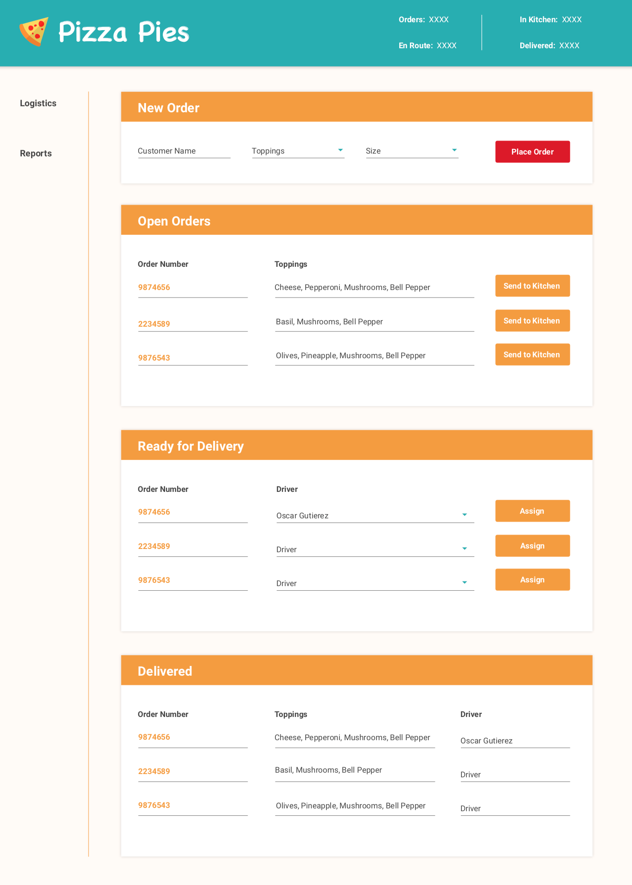
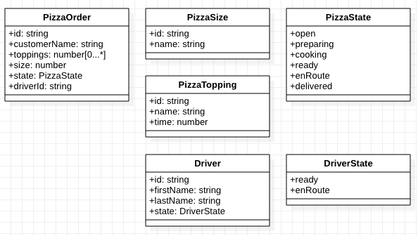

# Angular + NetCore Coding Assessment

This assessment consist of two different technical abilities that integrate together. The first project is desined to 
evaluate the front-end skillset through the use of Angular. The second project is designed to evaluate the skillset
for creating a RESTful API to support the front-end client.

### Scope
#### Angular + NetCore
Complete each individual technology, then integrate them with one another.

#### Angular
Complete the Angular functionality while utilizing the mock API server.

#### NetCore
Complete the API functionality while testing with PostMan or Insomnia.

### Time allotment:
+ Angular: Up to TBD hours may be spent on the initial implementation
+ NetCore: Up to TBD hours may be spent on the initial implementation
+ As much time as desired may be spent completing the stretch stories

This is desinged to create a full application with client and API integrations. However, this assessment does **not**
require for the application to be hardened of take all edge cases into consideration. In order to succeed with this
assessment, you should focus on the following:
#### Client
+ Component design
+ User of services with data streams
+ Avoid use of any state management framework

#### API
+ Effective aggregate design
+ Comprehensive business logic applied in the aggregates

### Assessment Workflow
Please see the [workflow process](readmes/workflow-process.md) for details of how to submit your solution.

**Angular**
- Following of the coding standards set forth by the Angular Style Guide, in addition to the following defined in 
[client standards](readmes/client/standards.md)

## Approach
A recommendation is to create the structure of the application and note how everything is 
interconnected by using `// TODO:` comments. This will allow you to deliver a complete theoretical solution.
After that is complete, start implementing the functionality.

It is unlikely that a complete, bug-free solution will be delivered within the given time frame. We are 
looking for the  problem solving skills versus 100% functioning and bug-free code.

## Stories

#### Client
+ [C-1002 - Open Orders](readmes/stories/open-orders.md)
+ [C-1003 - Ready for Delivery](readmes/stories/ready-for-delivery.md)

#### API
+ [A-1000 - Pizza Stores API](readmes/stories/pizza-store-api.md)
+ [A-1003 - Orders API](readmes/stories/order-api.md)
    
## Mockup

## UML

